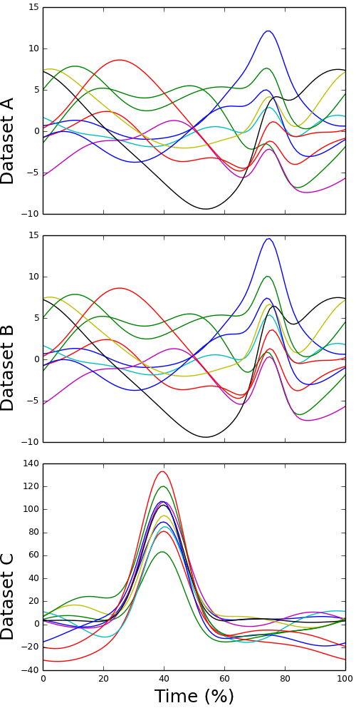

# data1d
data1d: Simulated univariate one-dimensional datasets for demonstrating continuum-level statistical analysis.


<p align="left">
  
</p>


Overview
-----------------------------------------
These three datasets were generated to illustrate the basic concepts of random field theory-based statistical inference. 
Each dataset contains ten scalar 1D trajectories, each with 101 nodes. 

- Datasets A and B represent one-sample (or paired) designs. 
- Dataset C represents a regression design, with the following independent variable values: [50, 53.75, 57.5, 61.25, 65, 75, 78.75, 82.5, 86.25, 90]


Data
-----------------------------------------

<a href="simscalar01.h5.zip" download>simscalar01.h5.zip</a> (HDF5 format)
<a href="simscalar01.csv.zip" download>simscalar01.csv.zip</a> (CSV format)


Reference
-----------------------------------------
Pataky TC, Vanrenterghem J, Robinson MA (2015). 
Zero- vs. one-dimensional, parametric vs. non-parametric, and confidence interval vs. hypothesis testing procedures in one-dimensional biomechanical trajectory analysis.
Journal of Biomechanics 48(7): 1277-1285.


Loading and viewing the data (MATLAB)
-----------------------------------------

```matlab
file_name = 'datasetA.h5'; 
y = hdf5read(file_name, '/y'); 
plot(y)
```


Loading and viewing the data (Python)
-----------------------------------------

```python
import tables 
from matplotlib import pyplot 

file_name = 'datasetA.h5' 
file_id = tables.openFile(file_name, mode='r') 
y = file_id.getNode('/y').read() 
file_id.close() 

pyplot.plot(y.T) 
pyplot.show()
```


Data format
-----------------------------------------
Please find more information about the HDF5 format at: <a href="http://www.hdfgroup.org/HDF5/">www.hdfgroup.org/HDF5</a> (for Matlab, Python, C, etc.)


Copyright
-----------------------------------------
Copyright (c) 2014 Todd Colin Pataky, Jos Vanrenterghem, and Mark Robinson

